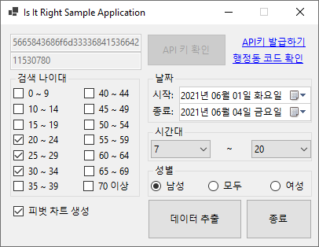

# 여기 어때? - Is It Right
.Net 5.0, 서울시 생활인구 기반 데이터 분석 라이브러리

- **한국어** (이 문서)

# 개요
[서울시 열린데이터 광장](https://data.seoul.go.kr)의 [서울 생활인구](https://data.seoul.go.kr/dataVisual/seoul/seoulLivingPopulation.do)를 활용한 행정동 별로 특정 조건에 알맞게 원하는 데이터를 검색 및 추출하여 Excel 형식으로 저장 및 피벗 차트 생성을 해주는 라이브러리 입니다.

## 환경 구성
아래와 같은 요구사항을 만족해야 사용이 가능합니다.

- `.Net 5.0`을 지원하는 시스템 및 [.Net 5.0 SDK가 설치](https://dotnet.microsoft.com/download/dotnet/5.0)된 시스템
- Microsoft Office 제품군 중 `Excel`이 설치된 시스템

## 결과 예시
- 서울시 역삼 1동의 2021년 6월 1일~4일 7시~20시 까지의 남여 20-34세 생활인구 데이터

# 사용법
## 직접 빌드하여 사용
가장 [최신의 릴리즈](https://github.com/icaros7/IsItRight/releases/latest)를 받아 직접 .Net 5.0 환경에서 빌드하여 사용하실수 있습니다.

## 사전 컴파일 된 바이너리 사용
[최신의 릴리즈](https://github.com/icaros7/IsItRight/releases/latest)에서 바이너리 파일들을 통해 사전 컴파일된 바이너리를 참조시켜 사용이 가능합니다.

## GUI 어플리케이션 바로 사용 (일반 사용자)
   
이미 샘플 제공 및 릴리즈 되어 있는 GUI 기반의 `Windows` 어플리케이션 사용이 가능합니다. 이는 [별도의 GUI 문서](readme_gui.md)를 참고해 주십시오.

# 도큐멘트
별도의 도큐멘트는 존재하지 않으며 클래스 내 Summary 활용하여 어떤 기능인지 알 수 있습니다.

사용법에 대한 예제는 동봉된 `IsItRight-Sample-Console`에서 확인 가능합니다.

    using IsItRight;

    class Program{
        static void Main(string[] args){
            DataAnalytisc dataAnalytisc = new DataAnalytisc((string) API키, (int) 행정동 코드);
        }
    }

위 코드를 통해 가장 기본적인 C# 기반의 어플리케이션 사용이 가능 합니다.

## 라이브러리
- [Newtonsoft.Json](https://docs.microsoft.com/ko-kr/gaming/playfab/sdks/unity3d/licenses/newtonsoft-json-license)
