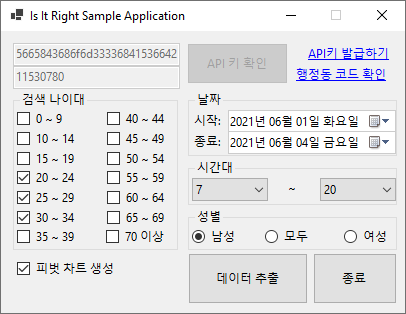

# 여기맞아? for Windows
.Net 5.0, 서울시 생활인구 기반 데이터 분석 라이브러리를 활용한 Windows 시스템용 레퍼런스 어플리케이션

# 시스템 요구사항
아래 사항은 일반적인 경우 입니다. 그 외 자세한 사항은 [Microsoft .Net 기본 사항 중 Windows에 설치 부분](https://docs.microsoft.com/ko-kr/dotnet/core/install/windows?tabs=net50#runtime-information)을 참고하십시오.

- Windows 8.1 포함 그 이후에 출시된 Windows를 실행 중인 시스템
- [.Net 5.0 데스크톱 런타임](https://dotnet.microsoft.com/download/dotnet/5.0)이 설치된 Windows 시스템

# 다운로드
[Is It Right 라이브러리의 가장 최신의 릴리즈](https://github.com/icaros7/IsItRight/releases/latest)에서 `IsItRight_Sample_WinForm-windows-1.0.0.0-RELEASE.zip`를 다운로드 받아 사용이 가능합니다.

별도의 사이닝이 되어 있지 않은 어플리케이션 이므로 실행 시 사용자 동의가 필요 합니다.